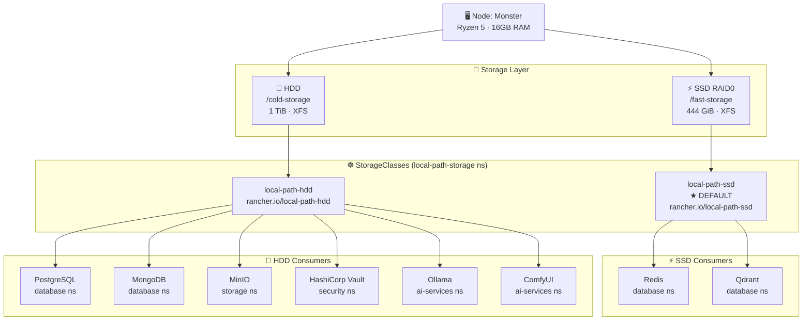
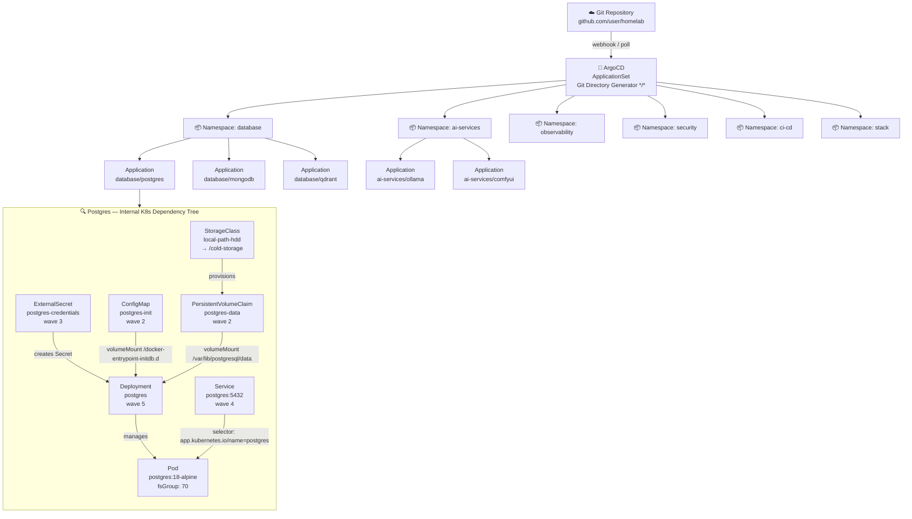

# 🏗️ Homelab GitOps Cluster — Architecture Documentation

> **Project Context:** This cluster serves as the infrastructure foundation for a Course Completion Project (TCC) focused on an **AI-driven project management analytics platform**. All services described here are deployed and managed via GitOps principles on a single-node bare-metal Kubernetes cluster.

---

## 0. Two-Phase Bootstrap Model

The cluster lifecycle is split into two distinct phases with a hard responsibility boundary:

```
┌─────────────────────────────────────────────────────────────────┐
│  PHASE 0 — Ansible                                              │
│  "Provision the platform to the point where GitOps can exist"   │
└──────────────────────────────┬──────────────────────────────────┘
                               │  ArgoCD installed & ApplicationSet applied
                               ▼
┌─────────────────────────────────────────────────────────────────┐
│  PHASE 1 — GitOps (ArgoCD)                                      │
│  "All application state lives in Git. Ansible never runs again" │
└─────────────────────────────────────────────────────────────────┘
```

### Phase 0 — Ansible Roles (Bootstrap Only)

Ansible is idempotent and can be re-run for cluster recovery, but it **never manages application workloads**. Its responsibility ends the moment ArgoCD is healthy and the root `ApplicationSet` is applied.

| Ansible Role | Responsibility |
|---|---|
| `common` | Base OS hardening, packages, SSH |
| `pki` | Private CA creation, certificate generation (`monster-ca-trust`, server certs) |
| `network_workstations` | Network interfaces, firewall, Wake-on-LAN, static routes |
| `nvidia_gpu` | NVIDIA driver installation |
| `kubernetes_core_workstations` | OS kernel tuning, `containerd` runtime, `kubeadm init`, **Cilium CNI**, CoreDNS config, `helm` |
| `kubernetes_cni_workstations` | TLS secrets via Reflector, **Traefik** ingress, **HashiCorp Vault** (init + unseal), **External Secrets Operator**, **ArgoCD** install + `AppProject` + root `ApplicationSet` |
| `kubernetes_scaling_workstations` | `metrics-server`, cluster autoscaler |
| `kubernetes_security_workstations` | RBAC policies, read-only sync service account for ArgoCD |
| `kubernetes_nvidia_workstations` | NVIDIA device plugin, `runtimeClassName: nvidia` registration |
| `tailscale` | VPN mesh for remote management |

### Phase 1 — GitOps Boundary (This Repository)

From the moment ArgoCD is running, **this Git repository is the only source of truth**. No `kubectl apply` is run manually. Every change is a `git commit`.

> **The handoff happens in `kubernetes_cni_workstations/tasks/argo_cd.yml`:**
> 1. ArgoCD is installed via server-side apply from the official manifests
> 2. Ansible waits for `argocd-server` Deployment to become `Available`
> 3. Ansible renders and applies the `AppProject` + root `ApplicationSet` from a Jinja2 template
> 4. ArgoCD takes over — it discovers all `*/*` app directories and reconciles them forever

---

## 1. Executive Summary

This cluster runs on a single bare-metal node ("Monster") equipped with an **AMD Ryzen 5 processor** and **16 GB of RAM**. Despite being a single-node setup, it is architected with production-grade patterns to serve as a realistic, reproducible development and research environment for the TCC platform.

| Attribute | Value |
|---|---|
| **Node** | Monster (single bare-metal node) |
| **CPU** | AMD Ryzen 5 |
| **RAM** | 16 GB |
| **Kubernetes Distribution** | Vanilla Kubernetes **v1.35** (`kubeadm` bootstrap, `pkgs.k8s.io` stable channel) |
| **GitOps Engine** | ArgoCD with ApplicationSet |
| **Secret Management** | HashiCorp Vault + External Secrets Operator |
| **Ingress Controller** | Traefik (with mTLS via `TLSOption`) |
| **GPU Runtime** | NVIDIA Container Runtime (`runtimeClassName: nvidia`) |

The cluster adopts a **pure GitOps model**: the Git repository is the single source of truth. No manual `kubectl apply` is ever used in production — every state change is committed to this repository and reconciled by ArgoCD automatically.

---

## 2. Storage Architecture — Dual-Tier Strategy

The node has two physically distinct storage tiers, provisioned through two independent instances of the [Rancher local-path-provisioner](https://github.com/rancher/local-path-provisioner), each registered as a separate Kubernetes `StorageClass`.

### 2.1 Tier Definitions

| Tier | Hardware | Mount Point | StorageClass | Default? | Capacity |
|---|---|---|---|---|---|
| **FAST** | 2× SSD in RAID0 over XFS | `/fast-storage` | `local-path-ssd` | ✅ Yes | ~444 GiB |
| **SLOW** | 1× HDD over XFS | `/cold-storage` | `local-path-hdd` | ❌ No | ~1 TiB |

### 2.2 Allocation Rules

The tier assignment for each workload is driven by its **I/O access pattern**, not just its size.

> **SSD Tier (`local-path-ssd`)** — Low-latency, high-IOPS workloads:
> - **Redis** — In-memory cache with AOF/RDB persistence; requires fast fsync
> - **Qdrant** — Vector database; random read-heavy ANN search operations

> **HDD Tier (`local-path-hdd`)** — Large sequential or archive-friendly workloads:
> - **PostgreSQL** — Relational database for platform services (lower IOPS profile, large WAL)
> - **MongoDB** — Document store; sequential scan heavy
> - **MinIO** — Object storage for raw data, artifacts, model outputs (large sequential writes)
> - **HashiCorp Vault** — Low-frequency secret reads; size is negligible but HDD is adequate
> - **Ollama** — LLM model weights (50–150 GB per model; sequential reads only)
> - **ComfyUI** — Diffusion model checkpoints, LoRA adapters, workflow outputs (~200 GB)

### 2.3 Provisioner Architecture

Each `StorageClass` is served by a **dedicated, isolated provisioner deployment** in the `local-path-storage` namespace — preventing any shared state or scheduling conflicts between tiers.

```
local-path-storage/
├── ServiceAccount: local-path-ssd-service-account
├── Deployment:     local-path-ssd-provisioner  (--provisioner-name rancher.io/local-path-ssd)
├── ConfigMap:      local-path-ssd-config        (nodePathMap: /fast-storage)
├── ServiceAccount: local-path-hdd-service-account
├── Deployment:     local-path-hdd-provisioner  (--provisioner-name rancher.io/local-path-hdd)
└── ConfigMap:      local-path-hdd-config        (nodePathMap: /cold-storage)
```

---

## 3. GitOps Pattern — ArgoCD ApplicationSet

### 3.1 The App of Apps via Directory Generator

ArgoCD is configured with a **master `ApplicationSet`** that uses the **Git Directory Generator** to recursively scan this repository for the pattern `*/*`. Any folder at exactly depth 2 (e.g., `database/postgres`, `ai_services/ollama`) is automatically discovered and deployed as an ArgoCD `Application`.

**Key architectural rule:** No individual `Application` manifests exist in this repository. The `ApplicationSet` creates them dynamically at runtime. Developers only commit native Kubernetes manifests.

```
Repository Root
├── ai_services/
│   ├── ollama/        ← Auto-detected → Application: ai-services/ollama
│   └── comfyui/       ← Auto-detected → Application: ai-services/comfyui
├── database/
│   ├── postgres/      ← Auto-detected → Application: database/postgres
│   ├── mongodb/       ← Auto-detected → Application: database/mongodb
│   └── qdrant/        ← Auto-detected → Application: database/qdrant
├── observability/     ...
├── security/          ...
├── ci_cd/             ...
├── stack/             ...
└── storage/           ...
```

### 3.2 Namespace Convention

Each ArgoCD `Application` deploys into the `namespace` declared inside the manifests themselves. The ApplicationSet does **not** impose a namespace — this keeps each app self-describing and portable.

### 3.3 Sync Waves

Resource ordering within each application is controlled via the `argocd.argoproj.io/sync-wave` annotation. The standard wave sequence used across all applications is:

| Wave | Resource Types |
|---|---|
| `"0"` | `Namespace` |
| `"1"` | `ClusterSecretStore` (Vault backend) |
| `"2"` | `PVC`, `ConfigMap` |
| `"3"` | `ExternalSecret` (generates the K8s `Secret` from Vault) |
| `"4"` | `Service`, `IngressRoute` |
| `"5"` | `Deployment` / `StatefulSet` |

### 3.4 ArgoCD Label Coupling (Dependency Tree)

All resources carry the full set of [Kubernetes recommended labels](https://kubernetes.io/docs/concepts/overview/working-with-objects/common-labels/). This is what enables ArgoCD to draw a deeply nested dependency graph in its UI:

```yaml
labels:
  app.kubernetes.io/name: <app-name>         # e.g., postgres
  app.kubernetes.io/instance: <app-name>     # e.g., postgres
  app.kubernetes.io/part-of: <category>      # e.g., database
  app.kubernetes.io/managed-by: argocd
```

Every `Service.spec.selector` targets pods using `app.kubernetes.io/name` + `app.kubernetes.io/instance`, ensuring ArgoCD can correctly trace the Service → Pod → PVC → StorageClass chain.

---

## 4. Infrastructure & Storage Diagram



---

## 5. ArgoCD GitOps Flow & Dependency Tree



---

## 6. Security Model

All sensitive credentials (database passwords, API keys, tokens) are stored in **HashiCorp Vault** (`security/vault`) and injected into pods via the **External Secrets Operator**. No plaintext `Secret` manifests exist in the repository.

The flow is:
```
Vault (KV v2) → ExternalSecret (ESO) → K8s Secret → Pod env vars
```

External access to services is protected by **mutual TLS (mTLS)** enforced via Traefik's `TLSOption` (`RequireAndVerifyClientCert`), using a private CA (`monster-ca-trust`). Services are only accessible to clients presenting a certificate signed by the cluster's internal CA.

---

## 7. Resource Budget Summary

With 16 GB of physical RAM, the following soft allocation is used to prevent OOMKills:

| Service | Namespace | RAM Request | RAM Limit |
|---|---|---|---|
| PostgreSQL | database | 512 Mi | 1536 Mi |
| MongoDB | database | 256 Mi | 512 Mi |
| Qdrant | database | 256 Mi | 512 Mi |
| Redis | database | 64 Mi | 256 Mi |
| Ollama | ai-services | 2 Gi | 8 Gi |
| ComfyUI | ai-services | 2 Gi | 8 Gi |
| **Total (approx.)** | | **~5.1 Gi** | **~18.7 Gi** |

> **Note:** The limit total intentionally exceeds physical RAM because AI services (Ollama, ComfyUI) are not expected to run simultaneously in this homelab context. The Kubernetes scheduler will prevent co-scheduling based on requests.

---

*Documentation generated as part of the TCC infrastructure design — 2026.*
